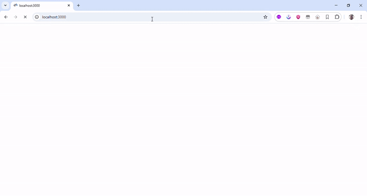

# Node.js Load Balancing with Docker, Kubernetes, and Nginx

It demonstrates how to containerize, deploy, and load balance multiple Node.js applications using **Docker**, **Kubernetes**, and **Nginx Reverse Proxy**.

---




## ⚙️ Dockerized Node.js Applications

- Built two independent Node.js apps.
- Created Docker images for both and pushed them to **Docker Hub** for seamless deployment and reusability.
**https://hub.docker.com/repository/docker/mohamednasser733/nodejs-app1/general**
**https://hub.docker.com/repository/docker/mohamednasser733/nodejs-app2/general**

---

## ☸️ Kubernetes Deployment & Load Balancing

- Deployed each Node.js app as a **Kubernetes Pod**.
- Exposed both apps using **ClusterIP Services**.
- Configured **Nginx** as a **Reverse Proxy** to load balance HTTP traffic between the two apps, ensuring smooth routing and high availability.

---

## 💡 Main Highlights

✅ **End-to-end deployment flow:** Dockerizing → Pushing Images → Kubernetes Deployment → Load Balancing.  
✅ **Hands-on microservices management** under a single Nginx proxy.  
✅ **Deepened understanding** of Kubernetes networking, services, and traffic routing.

---

## 🧠 Key Learnings

This project provided practical, hands-on experience in:
- Containerizing Node.js apps
- Working with Docker Hub repositories
- Deploying services on Kubernetes
- Implementing Nginx load balancing
- Managing scalable, fault-tolerant microservices

---

## 🛠️ Technologies Used

- Docker 🐳  
- Kubernetes ☸️  
- Nginx 🌐  
- Node.js 💚  
- Linux 🧩  

---

## 📸 Architecture Overview

```plaintext
          +-----------+
          |  Client   |
          +-----+-----+
                |
         +------v------+
         |   Nginx RP  |
         +------+------+ 
            /        \
     +------v--+   +--v------+
     | Node App1|  | Node App2|
     +----------+  +----------+
